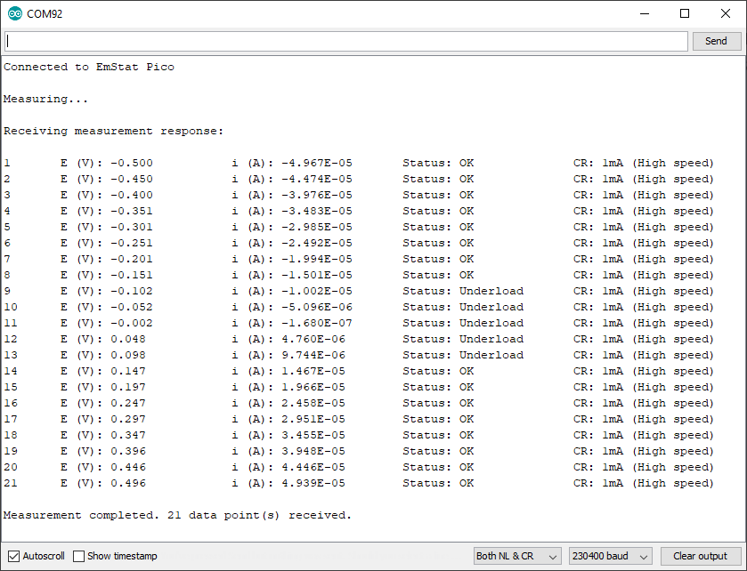

= MethodSCRIPT Example - Arduino
:doctype: article
:title-page:
:chapter-label:
:sectnums:
:tabsize: 4
:table-stripes: even
:icons: font
:xrefstyle: full

== Contents

The Arduino example _MethodSCRIPTExample.ino_ found in https://github.com/PalmSens/MethodSCRIPT_Examples/tree/master/MethodSCRIPTExample_Arduino[the _MethodSCRIPTExample_Arduino_ folder on GitHub] demonstrates basic communication with the EmStat Pico through an Arduino MKR Zero using MethodSCRIPT. The example allows the user to start measurements on a MethodSCRIPT-capable PalmSens instrument such as the EmStat Pico from a PC connected to the Arduino through USB.

This example is designed for and tested with the Arduino MKR Zero. It might work on other Arduino boards as well, but the MKR Zero is recommended.

== Hardware setup

* To run this example, connect your Arduino MKRZERO _Serial1_ port Rx (pin 13), Tx (pin 14) and GND to the EmStat Pico _Serial_ Tx, Rx and GND respectively.
* Make sure the UART switch block SW4 on the EmStat Pico dev board has the switches for MKR 3 and 4 turned on.
* The Arduino board should be connected normally to a PC.
* If not powering the EmStat Pico by other means, it should be connected to the PC through USB for power.

== Environment setup

To run this example, you must include the MethodSCRIPT C libraries and the MathHelper library.

NOTE: When upgrading from a previous version, the _MathHelperLibrary_ and _MethodSCRIPTComm_ folders have to be manually removed from the “user\Documents\Arduino\libraries” folder before performing this setup.

To include the libraries, follow the menu _Sketch -> Include Library -> Add .ZIP/Library_ and select the _MethodSCRIPTComm_ folder. Follow the same process to add the _MathHelperLibrary_ folder.

== How to use

* Compile and upload this sketch through the Arduino IDE.
* Next, open a serial monitor to the Arduino (you can do this from the Arduino IDE).
* You should see messages being printed containing measured data values from the EmStat Pico as shown in the screenshot below.

== Communications

The _MSComm.c_ from the MethodSCRIPT SDK (C libraries) acts as the communication object to read/write from/to the EmStat Pico.

As _MSComm_ is the communication object for the EmStat Pico it needs some read/write functions to be passed in through the `MSCommInit()`. However, because the C compiler doesn't understand C{plus}{plus} classes, the write/read functions from the Serial class are wrapped in a normal function, first as shown below.

[source,c++]
----
int write_wrapper(char c)
{
    if(s_printSent) {
    // Send all data to PC as well for debugging purposes
    Serial.write(c);
    }
    return Serial1.write(c);
}

int read_wrapper()
{
    int c = Serial1.read();
    if (s_printReceived && (c != -1)) { // -1 means no data
    //Send all received data to PC for debugging purposes
    Serial.write(c);
    }
    return c;
}
----

The MSComm library has to be initiated with these read/write functions. This is done in the `setup()` function as shown in the pseudo-code below.

[source,c++]
----
MSComm _msComm;
…

void setup()
{
    …
    RetCode code = MSCommInit(&_msComm, &write_wrapper, &read_wrapper);
    …
}
----

=== Connecting to the device

The code within the `setup()` function is executed only once.

In order to begin communication, the serial ports are initiated with the baud rate 230400.

[source,c++]
----
// Init serial ports
Serial.begin(230400);
Serial1.begin(230400);
// Wait until the Serial port is active
while(!Serial);
----

Serial is the port for communicating with the PC via the USB connection of the Arduino and used to print the parsed value.

Serial1 is the port for communicating with the Emstat Pico. This port is used to send the MethodSCRIPT and receive the resulting data to be parsed by the Arduino.

The MethodSCRIPT can be either stored in a SD-card on the Arduino or stored in a constant string. In the example, the MethodSCRIPT is stored in a constant char array as shown below.

[source,c++]
----
// LSV measurement configuration parameters
char const * LSV_METHOD_SCRIPT = "e\n"
                                 "var c\n"
                                 "var p\n"
                                 "set_pgstat_mode 3\n"
                                 "set_max_bandwidth 200\n"
                                 "set_cr 500u\n"
                                 "set_e -500m\n"
                                 "cell_on\n"
                                 "wait 1\n"
                                 "meas_loop_lsv p c -500m 500m 50m 100m\n"
                                 "pck_start\n"
                                 "pck_add p\n"
                                 "pck_add c\n"
                                 "pck_end\n"
                                 "endloop\n"
                                 "celloff\n"
                                 "\n";
----

=== Sending and receiving data packages

Now that the serial port and _MSComm_ object is set up the Arduino is able to interface with the EMstat Pico. The example uses the _MSComm_ library to perform read and write operations. Both read and write functions function require a reference to the initiated _MSComm_ struct (_msComm) to be passed along.

The `WriteStr()` function has one additional parameter which is the c-string to send to the EMstat Pico.

[source,c++]
----
void SendScriptToDevice(char const * scriptText)
{
    WriteStr(&_msComm, scriptText);
}
----

While looking almost identical to the write-function the ReceivePackage function uses the second argument for returning the received data.

[source,c++]
----
code = ReceivePackage(&_msComm, &data);
----

=== Parsing the measurement data packages

Each measurement data package returned by the function `ReadBuf()` in _MSComm_ library, can be parsed further to obtain the actual data values. For example, here is a set of data packages received from a Linear Sweep Voltammetry (LSV) measurement on a dummy cell with 10 kΩ resistance.

----
e\n
M0000\n
Pda7F85F3Fu;ba48D503Dp,10,288\n
Pda7F9234Bu;ba4E2C324p,10,288\n
Pda806EC24u;baAE16C6Dp,10,288\n
Pda807B031u;baB360495p,10,288\n
*\n
\n
----

While parsing a measurement package, various identifiers are used to identify the type of package. For example, In the above sample,

[arabic]
. `e` is the confirmation of the “execute MethodSCRIPT” command.
. `M` marks the beginning of a measurement loop.
. `P` marks the beginning of a measurement data package.
. `*\n` marks the end of a measurement loop.
. `\n` marks the end of the MethodSCRIPT.

Most techniques return the data values Potential (set cell potential in V) and Current (measured current in A). The data values to be received from a measurement can be sent through `pck` commands in the MethodSCRIPT.

In case of Electrochemical Impedance Spectroscopy (EIS) measurements, the following _variable types_ can be sent with the MethodSCRIPT and received as measurement data values:

* Frequency (set frequency in Hz).
* Real part of complex Impedance (measured impedance in Ω).
* Imaginary part of complex Impedance (measured impedance in Ω).

The following metadata values can also be obtained from the data packages, if present:

* CurrentStatus (OK, Underload, Overload, Overload warning).
* CurrentRange (the current range in use).
* Noise.

==== Parsing the measurement data packages

Each measurement data package begins with the header `P` and is terminated by a `\n`. The measurement data package can be split into data value packages based on the delimiter `;`.

Each of these data value packages can then be parsed separately to get the actual data values.

The type of data in a data package is identified by its variable type:

* The potential readings are identified by the string “_da_”
* The current readings are identified by the string “_ba_”
* The frequency readings are identified by the string “_dc_”
* The real impedance readings are identified by the string “_cc_”
* The imaginary impedance readings are identified by the string “_cd_”

For example, in the sample package seen above, the _variable types_ are:

`da7F85F3Fu` - “_da_” for potential reading and

`ba48D503Dp,10,288` - “_ba_” for current reading.

The following 7 characters hold the 28-bit signed integer data value followed by one SI unit prefix character. The data value for the current reading (7 characters) from the above sample package is `48D503D` followed by the SI unit prefix `p`.

In the above sample package, the SI unit prefix for current data is `p` (pico) which is 1e-12 A.

After obtaining variable type and the data values from the package, the metadata values can be parsed, if present.

==== Parsing the metadata values

The metadata values are separated based on the delimiter `,` and each of the values is further parsed to get the actual value.

The first character of each metadata value `metaData[0]` identifies the type of metadata.

`1` - status +
`2` - Current range index +
`4` - Noise

The metadata status is a 1 character hexadecimal bit mask.

For example, in the above sample, the available metadata values for current data are: `10,288`.

The first metadata value is `10`.

`1` - metadata status - `0` indicates OK.

The metadata type current range is represented by a 2-digit hexadecimal value. If the first bit is high (0x80), it indicates a high-speed mode current range. The hexadecimal value can be converted to int to get the current range.

For example, in the above sample, the second metadata available is `288`.

`2` - indicates the type - current range

`88` - indicates the hexadecimal value for current range index - 1 mA. The first bit 8 implies that it is high-speed mode current range.

==== Sample output

===== LSV

Here's a sample measurement data package from a LSV measurement on a dummy cell with 10 kΩ resistance and its corresponding output.

----
Pda7F85F3Fu;ba4BA99F0p,10,288
----

Output: +
E (V) = -4.999E-01 +
i (A) = -4.999E-01 +
Status : OK +
CR : 1mA (High speed) +

===== EIS

Here's a sample measurement data package from an EIS measurement on a dummy cell with 10 kΩ resistance and its corresponding output.

----
PdcDF5DFF4u;cc896D904m,10,287;cd82DB1A8u,10,287
----

Output: +
Frequency(Hz): 100.0 +
Zreal(Ohm): 9885.956 +
Zimag(Ohm): 2.995 +
Status: OK +
CR: 200uA (High speed)