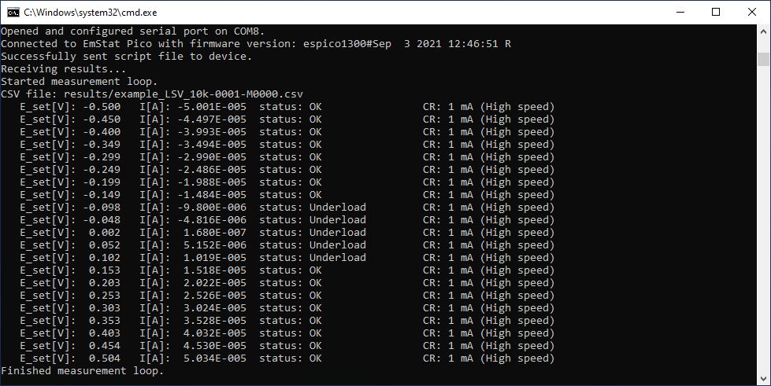
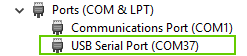

= MethodSCRIPT Example - C
:doctype: article
:title-page:
:chapter-label:
:sectnums:
:tabsize: 4
:table-stripes: even
:icons: font
:xrefstyle: full

== Contents

The example _example.c_ found in https://github.com/PalmSens/MethodSCRIPT_Examples/tree/master/MethodSCRIPTExample_C[the _src_ folder on GitHub] demonstrates basic communication with a MethodSCRIPT capable PalmSens instrument using C. The example allows the user to start measurements on (for example) the EmStat Pico from a Windows or Linux PC using a simple C program which makes use of the MethodSCRIPT SDK.

== Basic Console Example (example.c)

This example demonstrates how to implement serial communication with a PalmSens instrument. It performs the following steps:

* Establish a connection with the device.
* Write a MethodSCRIPT to the device.
* Read and parse the measurement data packages from the device.
* Print the parsed data to the console.
* Write the parsed data to file in CSV format.

The example code includes limited error handling. All packages within a MethodSCRIPT measurement loop are assumed to have the same format as the first package in that loop. The code serves as an example and starting point, and could be modified for each specific use case.

The code can be compiled using your IDE or compiler of choice. The example includes Makefiles for Linux and Windows, as well as a Microsoft Visual Studio project.

* On Linux, the example can be built using the standard C development tool (GCC {plus} GNU Make) using the command `make`.
* On Windows, the example can be built with MiNGW using the command `mingw32-make -f Makefile_windows` (a file `make.bat` is added so you can simply run `make`).
* On Windows, the project can also be built using Microsoft Visual Studio. A ready-to-use solution file is added to the project.
* For Eclipse users (Linux / Windows / macOS), the Eclipse CDT can also be used to build the example application.

The console output of one of the examples is shown below.

To run the demo, the compiled application should be started with two command-line arguments:

[arabic]
. The serial port to use, e.g., "COM8".
. The MethodSCRIPT to execute on the device. This is the name of a ".mscr" file inside the _scripts_ directory, without the directory, e.g., "example_LSV_10k". The same name will be used to create a CSV file in the _results_ directory.

So, on Windows, the example should be called like this:

[source,console]
----
example.exe COM8 example_LSV_10k
----

If the second argument (the script name) is not given, the application only connects to the device and prints the firmware version.

== Communications

Communicating over a serial port on Windows and Linux is done using standard file functions. However, opening and configuring the port requires some extra code, which depends on the operating system. The following sections explain the basics for Windows and Linux. Example implementations for Windows and Linux are provided in the files `esp_serial_port_windows.c` and `esp_serial_port_linux.c`, respectively. Both source files share the same interface, `esp_serial_port.h`, so the MethodSCRIPT example code can be written independent of the used implementation.

For MethodSCRIPT, the following settings are required for the serial port:

* baud rate: 230400 bps
* 8 databits
* no parity
* 1 stopbit

=== Serial port (Windows)

In Windows, the name of the COM port connected to the device can be found in the Windows 'Device Manager' as displayed below.

The serial port with name "COM37" can be opened as file using the path "\\.\COM37" (note that the backslashes should be escaped in C, so when defining this in the C code it has double the amount of backslashes).

Once the "file" is opened, the Windows API functions `GetCommState()` and `SetCommState()` should be used to configure the port. The settings are configured in the Device Control Block (DCB) object.

Timeouts can be configured using the `SetCommTimeouts()` function.

=== Serial port (Linux)

In Linux, the serial port of the EmStat Pico can be obtained by issuing the following command in the terminal:

[source,console]
----
dmesg {vbar} grep FTDI
----

It is usually called “ttyUSBx” where x is a number.

The serial port can be configured using the "termios" library. This is done using the following functions:

* `tcgetattr()` and `tcsetattr()` - get and set the port attributes
* `cfsetispeed()` and `cfsetospeed()` - used to configure the input and output baud rate

=== Sending the MethodSCRIPT

The MethodSCRIPT can be read from a text file. In this example, the MethodSCRIPT files are stored in the "scripts" directory. The function `mscript_send_file()` demonstrates how a file can be read from file and sent to the device.

=== Receiving measurement data packages

After a MethodSCRIPT has been started on the device, the results should be received by reading lines from the serial port. In the example, this is done in the function `process_response()`, by repeatedly calling `esp_comm_read_line()`. The first character of each line determines the type of response, so this can be used to distinguish data package from other responses, such as the start or end of a measurement.

=== Parsing the measurement data packages

Each measurement data package returned by the function `esp_comm_read_line()` should be parsed to obtain the actual data values. For example, here is a set of data packages received from a Linear Sweep Voltammetry (LSV) measurement on a dummy cell with 10 kΩ resistance:

----
e\n
M0000\n
Pda7F85F3Fu;ba48D503Dp,10,288\n
Pda7F9234Bu;ba4E2C324p,10,288\n
Pda806EC24u;baAE16C6Dp,10,288\n
Pda807B031u;baB360495p,10,288\n
*\n
\n
----

While parsing a measurement package, various identifiers are used to identify the type of package. For example, In the above sample,

[arabic]
. `e` is the confirmation of the “execute MethodSCRIPT” command.
. `M` marks the beginning of a measurement loop.
. `P` marks the beginning of a measurement data package.
. `*\n` marks the end of a measurement loop.
. `\n` marks the end of the MethodSCRIPT.

Most techniques return the data values Potential (set cell potential in V) and Current (measured current in A). The data values to be received from a measurement can be sent through `pck` commands in the MethodSCRIPT.

In case of Electrochemical Impedance Spectroscopy (EIS) measurements, the following _variable types_ can be sent with the MethodSCRIPT and received as measurement data values.

* Frequency (set frequency in Hz).
* Real part of complex Impedance (measured impedance Ω).
* Imaginary part of complex Impedance (measured impedance in Ω).

The following metadata values can also be obtained from the data packages, if present:

* CurrentStatus (OK, Underload, Overload, Overload warning).
* CurrentRange (the current range in use).
* Noise.

The function `parse_data_package()` demonstrates how the response could be parsed. It requires a reference to an `MscriptDataPackage_t` structure, in which the parsed data will be stored.

==== Parsing the measurement data packages

Each measurement data package begins with the header `P` and is terminated by a `\n`. The measurement data package can be split into data value packages based on the delimiter `;`.

Each of these data value packages can then be parsed separately to get the actual data values.

The type of data in a data package is identified by its variable type:

* The potential readings are identified by the string “_da_”
* The current readings are identified by the string “_ba_”
* The frequency readings are identified by the string “_dc_”
* The real impedance readings are identified by the string “_cc_”
* The imaginary impedance readings are identified by the string “_cd_”

For example, in the sample package seen above, the _variable types_ are:

`da7F85F3Fu` - "_da_" for potential reading and

`ba48D503Dp,10,288` - “_ba_” for current reading.

The following 7 characters hold the 28-bit signed integer data value followed by one SI unit prefix character. The data value for the current reading (7 characters) from the above sample package is `48D503D` followed by the SI unit prefix `p` (pico, which is 1e-12 A).

After obtaining variable type and data values from the package, the metadata values can be parsed, if present.

==== Parsing the metadata values

The metadata values are separated based on the delimiter `,` and each of the values is further parsed to get the actual value.

The first character of each metadata value `metaData[0]` identifies the type of metadata.

`1` - status +
`2` - Current range index +
`4` - Noise

The metadata status is a 1 character hexadecimal bit mask.

For example, in the above sample, the available metadata values for current data are: `10,288`. The first metadata value is `10`.

`1` - metadata status - `0` indicates OK.

The metadata type current range is represented by a 2-digit hexadecimal value. If the first bit is high (0x80), it indicates a high-speed mode current range. The hexadecimal value can be converted to int to get the current range.

For example, in the above sample, the second metadata available is `288`.

`2` - indicates the type - current range

`88` - indicates the hexadecimal value for current range index - 1 mA. The first bit 8 implies that it is high-speed mode current range.

==== Sample output

===== LSV

Here's a sample measurement data package from a LSV measurement on a dummy cell with 10 kΩ resistance and its corresponding output.

----
Pda7F85F3Fu;ba4BA99F0p,10,288
----

Output: +
E (V) = -4.999E-01 +
i (A) = -4.999E-01 +
Status : OK +
CR : 1mA (High speed) +

===== EIS

Here's a sample measurement data package from an EIS measurement on a dummy cell with 10 kΩ resistance and its corresponding output.

----
PdcDF5DFF4u;cc896D904m,10,287;cd82DB1A8u,10,287
----

Output: +
Frequency(Hz): 100.0 +
Zreal(Ohm): 9885.956 +
Zimag(Ohm): 2.995 +
Status: OK +
CR: 200uA (High speed)