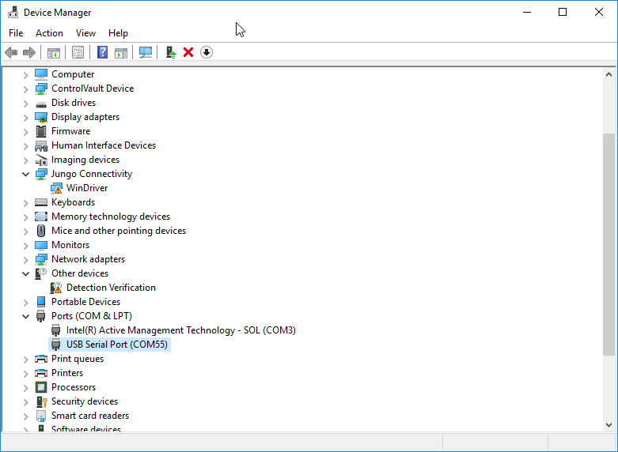
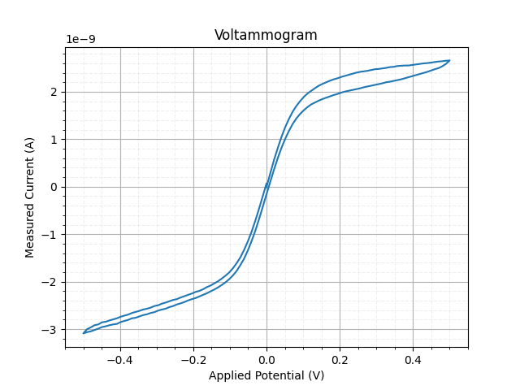
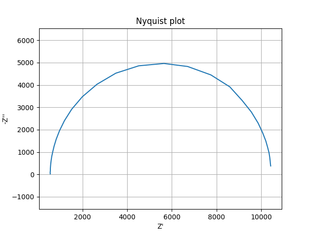
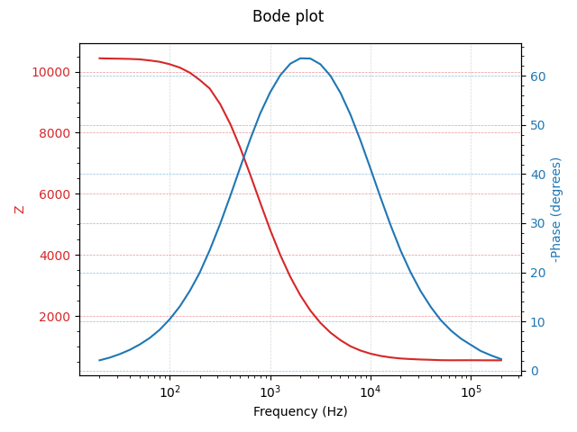
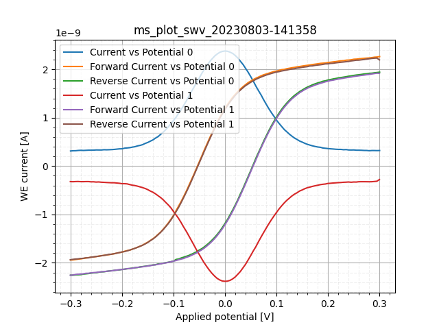

= MethodSCRIPT Example - Python
:doctype: article
:title-page:
:chapter-label:
:sectnums:
:tabsize: 4
:table-stripes: even
:icons: font
:xrefstyle: full

== Contents
The https://github.com/PalmSens/MethodSCRIPT_Examples/tree/master/MethodSCRIPTExample_Python[_MethodSCRIPTExample_Python_] folder on GitHub contains multiple example python scripts.

The example _console_example.py_ demonstrates basic communication with a MethodSCRIPT capable PalmSens instrument using Python. It demonstrates how to connect with the device, send and execute a script, and receive and interpret the response.

The _plot_cv.py_ example demonstrates the common electrochemical technique, Cyclic Voltammetry, and plots the resulting voltammogram.

The _plot_eis.py_ example demonstrates the Electrochemical Impedance Spectroscopy technique and draws the resulting Nyquist and Bode plots.

The _plot_advanced_swv.py_ example demonstrates the Square Wave Voltammetry (SWV) technique and plots multiple curves sharing a common x axis.

The _palmsens_ directory contains Python modules that provide methods for communication with the PalmSens instruments, and parsing the output of a MethodSCRIPT. All above-mentioned examples are based on these modules.

== Examples

=== Example 1: Console Example (console_example.py)

This example opens a communication port, sends a MethodSCRIPT file, reads and parses the device responses and prints the parsed data (variable type, value, unit) to the console. Also the metadata (status, current range) are parsed in this example.

To communication port to be used is specified in the variable DEVICE_PORT. If this variable is None (the default value), the script tries to auto-detect the COM port. This only works if there is only one device connected with a matching name, and is only tested on Windows. If the auto-detection does not work, you should manually change this variable to specify the correct port.

The name of the COM port connected to the PalmSens instrument can be looked up in the Device manager in Control Panel in Windows, as shown below. In this case, an EmStat Pico device is connected using COM55.

.Available com ports in device manager

This example script opens the specified port and checks what type of device is connected. Since this example was initially written for an EmStat Pico device, it will print a warning if the connected device is not an EmStat Pico. However, the script will also run successfully with an EmStat4S, for example. If a MethodSCRIPT capable device is recognized, the version information and the serial number are printed, a MethodSCRIPT file is sent to the device and the returned measurement packages are parsed into variables with their corresponding value and unit. Each data package is printed to the console in a more human-friendly format.

Here's a sample measurement data package in response to a MethodSCRIPT, _example_cv.mscr_, on a PalmSens Dummy Cell (10 kΩ) and its corresponding output.

----
Pda84E63DAn;ba82AB973f,14,284
----

Output: +
Applied potential = 0.005137 V +
WE current = 2.8e-09 A +
STATUS: UNDERLOAD +
CR: 25 uA (High speed)

=== Example 2: Cyclic Voltammetry Plot Example (plot_cv.py)

This example performs a Cyclic Voltammetry (CV) on a PalmSens Dummy Cell WE A (RedOx Circuit) and plots the I vs E curve.

The first part of the example connects to the EmStat Pico, sends the MethodSCRIPT file "example_cv.mscr", reads the data and saves it to a text file in the _output_ directory. The second part of the example parses the data to a value matrix and plots the I vs E curve as shown below.

.CV on PalmSens Dummy Cell WE A (RedOx circuit)

=== Example 3: EIS Plot Example (plot_eis.py)

This example performs an EIS (Electrochemical Impedance Spectroscopy) measurement on a PalmSens Dummy Cell WE C (Randles circuit) and generates a Nyquist plot and a Bode plot.

The parsed values are stored in a matrix, where the first column (index 0) holds the applied frequencies, the second column (index 1) holds the real part of the complex impedance and the third column (index 2) holds the imaginary part of the complex impedance. The complex impedance is composed from the real and imaginary parts and the absolute impedance (Z) and phase are calculated from the complex impedance, _z_complex_. A sample Nyquist plot and a Bode plot for an EIS scan on a dummy cell with Randles circuit are shown below.

[width="100%",cols="50%,50%",options="header",]
|===
a|
.Sample plot EIS: Nyquist plot

a|
.Sample plot EIS: Bode plot

|===

=== Example 4: Advanced SWV Plot (plot_advanced_swv.py)

This example showcases some of the more advanced features. The example runs a script that contains two SWV measurements. This example is meant to be run on the PalmSens RedOx dummy cell (WE A). An example output plot is shown in Figure 5.

The example script can easily be adjusted to plot the output of another MethodSCRIPT in a similar way. To do this, simply change the variables `COLUMN_NAMES`, `XAXIS_COLUMN_INDEX` and `YAXIS_COLUMN_INDICES` to configure which columns to plot and which names to use in the figure.

.SWV on PalmSens Dummy Cell WE A (RedOx circuit)

== Installation & requirements

To run the Python examples, a recent version of Python 3 is required. The scripts were developed and tested with Python 3.9.

A few external modules are used in the examples. For serial communication, the _pyserial_ package is used. For parsing and plotting the data, the _matplotlib_ and _numpy_ packages are used.

To install all packages to your current Python environment, simply run the following command:

[source,console]
----
python -m pip install -r requirements.txt
----

It is recommended to create a virtual environment using the venv module.

== Communications

=== Connecting to the device

The examples use the _pySerial_ package for serial communication with the device. This package offers a convenient interface to communicate with any device using a serial port. The baud rate must be configured to 230400 bps. For all other settings, the defaults can be used. The timeout should be configured to match the application code.

=== Sending a MethodSCRIPT

The MethodSCRIPT can be read from a text file and then sent to the device. In these examples, the MethodSCRIPT files are stored in the _scripts_ directory.

=== Receiving the measurement packages

Once the script file is sent to the device, the measurement packages can be read continuously, line by line from the device, using the method `serial.readline()`. In our example code, we provide two example methods that also demonstrate how to decode the received bytes objects into str objects and how to handle communication timeouts:

[source,python]
----
line = instrument.readline()

result_lines = instrument.readlines_until_end()
----

=== Parsing the response

The measurement data packages received from the device should be parsed to obtain the actual data values. For example, here's a set of data packages received from a Linear Sweep Voltammetry (LSV) measurement on a dummy cell with 10 kΩ resistance:

----
eM0000\n
Pda7F85F3Fu;ba48D503Dp,10,288\n
Pda7F9234Bu;ba4E2C324p,10,288\n
Pda806EC24u;baAE16C6Dp,10,288\n
Pda807B031u;baB360495p,10,288\n
*\n
\n
----

While parsing a measurement package, various identifiers are used to identify the type of package. In the above sample:

[arabic]
. `e` is the confirmation of the “execute MethodSCRIPT” command.
. `M` marks the beginning of a measurement loop.
. `P` marks the beginning of a measurement data package.
. `*\n` marks the end of a measurement loop.
. `\n` marks the end of the MethodSCRIPT.

The data values to be received from a measurement can be sent through `pck` commands in the MethodSCRIPT. Most techniques return the data values Potential (set cell potential in V) and Current (measured current in A). These can be sent with the MethodSCRIPT.

In case of Electrochemical Impedance Spectroscopy (EIS) measurements, the following _variable types_ can be sent with the MethodSCRIPT and received as measurement data values.

* Frequency (set frequency in Hz).
* Real part of complex Impedance (measured impedance Ω).
* Imaginary part of complex Impedance (measured impedance in Ω).

The following metadata values can also be obtained from the data packages, if present:

* status (OK, Loop timing not met, Underload, Overload, Overload warning).
* Current range (the current range in use).
* Noise.

The example code contains two methods that demonstrate how to parse the data packages:

* `parse_mscript_data_package()` converts one received line to a list of MethodSCRIPT variables. Each object in the list contains the value, variable type, unit, metadata, etc.
* `parse_result_lines()` converts a list of received lines into a list of "curves", where each curve represents the data from one measurement loop. A curve itself is a list measurement points, each point corresponding to one response line (as parsed using `parse_mscript_data_package()`).